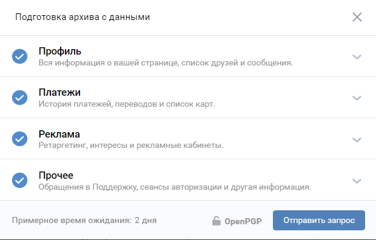

# VKArchiveDownloader 

Утилита для скачивания данных по ссылкам, которые можно получить из [архива](https://vk.com/faq18145) аккаунта [VKontakte](https://vk.com/feed).

- [VKArchiveDownloader ](#vkarchivedownloader-)
  - [1. Описание работы](#1-описание-работы)
  - [2. Результат работы](#2-результат-работы)
    - [2.1 JSON файл с ссылками](#21-json-файл-с-ссылками)
    - [2.2 Папки с данными](#22-папки-с-данными)
    - [2.3 Логи работы утилиты](#23-логи-работы-утилиты)
  - [3. Использование утилиты](#3-использование-утилиты)
    - [3.1 Использование `Сookie` файлов браузера](#31-использование-сookie-файлов-браузера)
    - [3.2 Настройка через файл конфигурации `config.ini`](#32-настройка-через-файл-конфигурации-configini)
    - [3.3 Запуск утилиты, используя исходный код (рекомендуется)](#33-запуск-утилиты-используя-исходный-код-рекомендуется)
    - [3.4 Запуск утилиты, используя собранный `exe` файл для Windows x64](#34-запуск-утилиты-используя-собранный-exe-файл-для-windows-x64)
  - [4. Вопросы и ответы](#4-вопросы-и-ответы)
    - [4.1 Почему нет поддержки скачивания видео?](#41-почему-нет-поддержки-скачивания-видео)
    - [4.2 Почему в папке сообщений или в папке документов начали появляется скачивания по пути `*/text/html` без разрешения файла?](#42-почему-в-папке-сообщений-или-в-папке-документов-начали-появляется-скачивания-по-пути-texthtml-без-разрешения-файла)
    - [4.3 Почему в логах начали часто появляется ошибки, связанные с `asyncio.TimeoutError`?](#43-почему-в-логах-начали-часто-появляется-ошибки-связанные-с-asynciotimeouterror)
    - [4.4 Почему выдается ошибка, подобная `PermissionError: [Errno 13] Permission denied: '.../Cookies'`?](#44-почему-выдается-ошибка-подобная-permissionerror-errno-13-permission-denied-cookies)
    - [4.5 Фактически, доступ к сжатым фото и голосовым сообщениям может получить любой человек, у которого на них есть ссылка?](#45-фактически-доступ-к-сжатым-фото-и-голосовым-сообщениям-может-получить-любой-человек-у-которого-на-них-есть-ссылка)
    - [4.7 Как работает скачивание по ссылкам (для любопытных)?](#47-как-работает-скачивание-по-ссылкам-для-любопытных)
  - [5. Тесты производительности](#5-тесты-производительности)

## 1. Описание работы

С помощью данной утилиты возможно скачать данные по ссылкам, которые, так или иначе разбросаны по архиву [VKontakte](https://vk.com/feed).

Информация о поддерживаемых данных, которые можно скачать:
| Тип данных  | Поддержка | Сохранение по дате | Примечание                                                                         | Папка хранения          |
| ----------- | :-------: | :----------------: | ---------------------------------------------------------------------------------- | ----------------------- |
| `Сообщения` |     ✅     |         ✅          | Полная поддержка **[*]**, [кроме видео](#41-почему-нет-поддержки-скачивания-видео) | `./output/messages`     |
| `Стена`     |     ✅     |         ✅          | Все фото со стены скачиваются из `photos` (`Фото`)                                 | `./output/photos`       |
| `👍->Фото`   |     ✅     |         ❌          | Полная поддержка **[*]**                                                           | `./output/likes/photos` |
| `Фото`      |     ✅     |         ✅          | Полная поддержка                                                                   | `./output/photos`       |
| `Файлы`     |     ✅     |         ✅          | Полная поддержка **[*]**                                                           | `./output/profile`      |
| `Музыка`    |     ❌     |         ❌          | В архиве есть только названия песен, но не ссылки                                  | `-`                     |

**[*]** - [Если включен доступ к `Сookie` файлам.](#31-использование-сookie-файлов-браузера)

## 2. Результат работы

Результат работы утилиты будет находится в директории `output`.

### 2.1 JSON файл с ссылками

В папке `output`, после работы утилиты, будет находится файл `links_info.json`. Его содержание зависит от того, какие данные были запрошены в архиве.

Пример `links_info.json`, где были запрошены все поддерживаемые типы данных:

```json
{
    "messages": {
        "id диалога/беседы": {
            "name": "Имя диалога/беседы",
            "dialog_link": "Ссылка на диалог/беседу",
            "Тип данных": ["Ссылки, связные с типом данных"]
        }
    },
    "photos": {
        "Имя альбома": {
          "Тип данных": ["Ссылки, связные с типом данных"]
        }
    },
    "likes/photo": {
        "not_parse": ["Ссылки, связные с типом данных"]
    }

}
```

Для каждой папки из архива, в которой происходит поиск, все ссылки отсортированы по типу контента или их поведения.

Возможные типы разделения ссылок:

- Разделение на основе информации о том, на что ссылается ссылка. Информация содержится в заголовке ответного запроса `content-type`, о котором [подробнее можно прочитать тут](https://developer.mozilla.org/ru/docs/Web/HTTP/Basics_of_HTTP/MIME_types). Чаще всего, встречаются следующие типы:
  - `image/jpeg`: изображения в формате `jpeg`;
  - `image/png`: изображения в формате `png`;
  - `image/gif`: анимационные изображения в формате `gif`;
  - `video/mp4`: видеофайлы в формате `mp4`;
  - `audio/ogg`: аудиофайлы в формате `ogg`. Обычно, голосовые сообщения;
  - `application/octet-stream`: базовый тип бинарных данных. Может быть чем угодно;
  - `application/pdf`: файлы `PDF`;
  - `application/msword`: файлы Microsoft Word, а именно, файлы `doc`;
  - `application/vnd.openxmlformats`: файлы Microsoft Word, а именно, файлы `docx`;
  - `application/zip`: `ZIP` архивы;
  - `application/x-rar-compressed`: `RAR` архивы;
  - `text/plain`: текстовые файлы `txt`;
- Ссылки, связанные с [VKontakte](https://vk.com/feed):
  - `vk_contact`: ссылки на профили людей или сообществ;
  - `vk_video`: ссылка на видео;
  - `vk_story`: ссылка на истории;
- Ссылки, при работе с которыми были получены ошибки:
  - `error`: ссылки [VKontakte](https://vk.com/feed), переход по котором приводит к ошибке. Например, ошибке отсутствия файла на серверах;
  - `not_parse`: ссылки, парсинг которых был неудачен или пропущен;
- `telegram_contact`: ссылки на профили [мессенджера Telegram](https://telegram.org/);
- `github_link`: ссылки, связанные с [GitHub](https://github.com/);
- `aliexpress_link`: ссылки, связанные с [AliExpress](https://aliexpress.ru/);
- `pastebin_link`: ссылки, связанные с [Pastebin](https://pastebin.com/);
- `gdrive_link`: ссылки, связанные с [Google Drive](https://drive.google.com/);
- `google_link`: ссылки, связанные с [Google.com](https://www.google.com/);
- `wikipedia_link`: ссылки, связанные с [Wikipedia](https://www.wikipedia.org/);
- `🍓`: ссылки, связанные с [PornHub](https://www.pornhub.com/);
- `dns_shop_link`: ссылки, связанные с магазином [DNS](https://www.dns-shop.ru/).

### 2.2 Папки с данными

В папке `output`, после работы утилиты, будут находится папки с данными, которые удалось получить.

Возможные папки при условии, если присутствуют исходные данные в архиве, можно просмотреть в [таблице поддерживаемых типов данных](#1-описание-работы).

### 2.3 Логи работы утилиты

В процессе работы утилиты, весь процесс работы логируется и хранится в папке `logs`.

## 3. Использование утилиты

Перед использованием утилиты необходимо запросить [данные архива на официальной странице VKontakte](https://vk.com/data_protection?section=rules&scroll_to_archive=1).

[VKontakte](https://vk.com/feed) дает возможность архивировать разные данные, в зависимости от пожеланий и терпения. Чем больше данных выбрано, тем больше времени будет формироваться архив.
Утилита сможет забрать любые [поддерживаемые данные](#1-описание-работы), которые найдет, вне зависимости от выбора.



### 3.1 Использование `Сookie` файлов браузера

Утилита поддерживает использование `Сookie` файлов некоторых браузеров. Это может понадобится для скачивания контента, для которого необходима авторизация на сайте [VKontakte](https://vk.com/feed).

Пример таких данных (сложно перечислить их всех, проще сказать, что все, кроме сжатых фото и голосовых сообщений):

- Бинарные данные (`.doc`, `.docx`, `.pdf`, etc);
- `ZIP` архивы;
- Текстовые файлы (`.txt`, `.ini`, `.py`, etc);
- Фото, которые были отправлены документом, чтобы избежать сжатия;
- etc.

Поддерживается множество популярных браузеров и ОС. Их список можно найти на
[странице используемого для этого модуля `browser_cookie3`](https://github.com/borisbabic/browser_cookie3#testing-dates--ddmmyy).

Для того, что утилита могла использовать такие `Сookie` файлы, достаточно авторизоваться в учетной записи [VKontakte](https://vk.com/feed), для которой был сформирован архив
используя браузер, [который поддерживается со стороны `browser_cookie3`](https://github.com/borisbabic/browser_cookie3#testing-dates--ddmmyy).

> :warning: **`Сookie` файлы аккаунта будут использованы исключительно для доступа к ресурсам [VKontakte](https://vk.com/feed) и не будут переданы на сторонние ресурсы.**

### 3.2 Настройка через файл конфигурации `config.ini`

Работа утилиты может быть настроена в конфигурационном файле `config.ini`.

Доступные параметры:

- `main_parameters` - главные параметры утилиты:
  - `use_coockie=True`

    Использование `Coockie` файлов [VKontakte](https://vk.com/feed) для скачивания документов.
    `True` - использовать `Coockie` файлы, `False` - не использовать;

  - `semaphore_small=40`

    Количество одновременных скачиваний файлов малого размера, таких, как фото.
    Если скорость сети оставляет желать лучшего, стоить уменьшить данное значение.
    40 одновременных скачиваний отлично работает на 150-200 мбит/c;

  - `semaphore_big=10`

    Количество одновременных скачиваний файлов большого размера, таких, как документы.
    Если скорость сети оставляет желать лучшего, стоить уменьшить данное значение.
    10 одновременных скачиваний отлично работает на 150-200 мбит/c;

  - `core_count=0`

    Количество потоков для поиска ссылок в архиве.
    Если значение равно 0 - автоматическое определение количества используемых потоков;

  - `log_level=INFO`

    Уровень ведения лог-файла.
    `INFO` - только сообщения ошибок, предупреждений и информация.
    `DEBUG` - сообщения ошибок, предупреждений, информации, а также сообщения отладки (для разработчика);

  - `delete_output_folder=True`

    Нужно ли отчищать содержимое папки результата перед выполнением скрипта.
    Удобнее не удалять результаты работы скрипта, если скачивание идет частями.
    `True` - отчищать, `False` - оставить нетронутым.

  - `save_by_date=True`
    
    Нужно ли разделять сохраняемые файлы по подпапкам,
    на основе даты (для файлов и альбомов - дата загрузки, для сообщений - дата сообщения).
    `True` - разделять, `False` - оставить обычную логику сохранения.

  - disable_ssl=False
    Отключает проверку SSL сертификата. Шифрования трафика не будет использоваться, используйте только под вашу ответственность.
    Стоит использовать только в безопасной сети и в случаях, когда возникают ошибки вида: 
    ```Cannot connect to host [...] certificate verify failed: self signed certificate in certificate chain```


- `folder_parameters` - параметры папок архива.
  По умолчанию, используются имена папок, которые встречаются в архиве ВК (проверено в 2022 году):

  - `vk_archive_folder=Archive`

    Имя папки архива VK;

  - `messages_folder=messages`

    Имя папки сообщений.
    Если закомментировано в конфигурационном файле - парсинг данной папки будет пропущен;

  - `profile_folder=profile`

    Имя папки профиля (документов аккаунта).
    Если закомментировано в конфигурационном файле - парсинг данной папки будет пропущен;

  - `photos_folder=photos`

    Имя папки фото.
    Если закомментировано в конфигурационном файле - парсинг данной папки будет пропущен;

  - `likes_folder=likes/photo`

    Имя папки лайков и папки лайкнутых фото.
    Если закомментировано в конфигурационном файле - парсинг данной папки будет пропущен.

### 3.3 Запуск утилиты, используя исходный код (рекомендуется)

Для запуска утилиты из исходного кода в системе должен быть установлен [Python 3.10.5 или выше](https://www.python.org/).

> :warning: **Для установки зависимостей в ОС Windows, [скорее всего, понадобится Microsoft Visual C++ версии 14.0 или выше.](https://stackoverflow.com/questions/40504552/how-to-install-visual-c-build-tools)**

Необходимо скачать или клонировать репозиторий в удобное для работы место. Предварительно стоит убедиться, установлен ли в системе [Git](https://git-scm.com/download/win),
если будет происходить клонирование репозитория, а не скачивание исходного кода с сайта.

Клонирование репозитория:

```bash
git clone https://github.com/DvaMishkiLapa/VKArchiveDownloader.git
```

В клонированную или скачанную директорию необходимо поместить директорию архива [VKontakte](https://vk.com/feed) `Archive`. Сделайте это любым удобным для вас способом.

После клонирования или скачивания репозитория, а также перемещения папки `Archive`, необходимо в директории репозитория развернуть виртуальное окружение `venv`.

Для ОС Windows необходимо открыть CMD, PowerShell или [Windows Terminal](https://apps.microsoft.com/store/detail/windows-terminal/9N0DX20HK701?hl=fr-ch&gl=ch) в папке репозитория и ввести следующие команды:

```bash
py -m venv .venv
```

```bash
.\.venv\Scripts\activate
```

> :warning: В Windows 10 и выше возможна ошибка, связанная с запретом выполнения скриптов в системе. [Тут хорошая статься с описанием и решением этой проблемы](https://www.itechtics.com/enable-script-execution-powershell/).

Для ОС Linux необходимо в папке репозитория ввести следующие команды:

```bash
python3 -m venv .venv
```

```bash
source ./.venv/bin/activate
```

После разворачивания виртуального окружения необходимо установить зависимости:

```bash
pip install -r requirements.txt
```

После всех шагов необходимо запустить утилиту и ждать ее завершения:

```bash
python main.py
```

### 3.4 Запуск утилиты, используя собранный `exe` файл для Windows x64

> :warning: Для данного способа не требуется установка [Python](https://www.python.org/). Но замечено, что **в таком режиме утилита работает, примерно, на 15% медленнее**.

Необходимо [скачать последний собранный релиз `VKArchiveDownloader_win64.zip`](https://github.com/DvaMishkiLapa/VKArchiveDownloader/releases/latest)
и распаковать архив с ним в любую удобную папку.

После этого необходимо поместить директорию архива [VKontakte](https://vk.com/feed) `Archive` в директорию распакованной утилиты. Сделайте это любым удобным для вас способом.

После всех шагов подготовки запустите `VKArchiveDownloader.exe` любым удобным способом.

## 4. Вопросы и ответы

### 4.1 Почему нет поддержки скачивания видео?

Есть несколько причин, по которым это не реализовано:

1. **Странное поведения доступа к ссылке на само видео.** Не ясно почему, но я не всегда могу получить ссылку на исходник видео в максимальном качестве.
2. **Скачивание займет много времени и займет большое пространство на постоянном носителе.** Время - не самый критичный параметр. Но размер самого видео - уже более весомый аргумент, учитывая, что не все видео, в итоге, будут нужны после скачивания.

Как альтернативу данному вопросу, после работы утилиты, в [JSON файле с ссылками](#21-json-файл-с-ссылками) будет отдельная категория `vk_video` со всеми ссылками на видео [VKontakte](https://vk.com/feed).

### 4.2 Почему в папке сообщений или в папке документов начали появляется скачивания по пути `*/text/html` без разрешения файла?

Это не решенная проблема. В папках лежат `html` страницы, которые [VKontakte](https://vk.com/feed) отдает на попытку скачать какой-либо документ.
В этот момент утилита сталкивается с ошибкой [429 Too Many Requests](https://developer.mozilla.org/ru/docs/Web/HTTP/Status/429),
которая появляется, если в день было слишком много попыток скачать документы.
Пока что, решением данной проблемы является время - нужно подождать 1-2 дня.
Проблема появится, если запускать утилиту за один день множество раз, например, с разными настройками.
Стоит помнить о таком поведении [VKontakte](https://vk.com/feed).

Также данная проблема может встретится, если а архиве содержится *безумно* много ссылок на документы в случае, если, например, аккаунт был довольно активным в использовании.
Выходом из такой ситуации может стать разделение скачиваемого контента по дням.
Например, в 1 день в `config.ini` оставить только настройку с сообщениями и запустить утилиту, а в следующий день выбрать другую категорию.

### 4.3 Почему в логах начали часто появляется ошибки, связанные с `asyncio.TimeoutError`?

Для скачивания файлов в утилите заложен таймаут в 15 минут. Если за это время файл не будет скачан, скачивание оборвется с ошибкой `asyncio.TimeoutError` в лог-файле.

Что бы решить данную проблему, стоит уменьшить количество одновременных скачиваний в настройке `semaphore_small` и `semaphore_big` конфигурационного файла `config.ini`.

Для удобства, все ссылки, которые быль обработаны и для них была получена ошибка тайм-аута, будут собраны в отдельную группу данных `timeout_error` в файле `links_info.json`.

### 4.4 Почему выдается ошибка, подобная `PermissionError: [Errno 13] Permission denied: '.../Cookies'`?

Она возникает, если Google Chrome или браузер, основанный на его движке, открыт во время работы скрипта.
Как вариант решения проблемы, можно закрыть браузер перед началом работы скрипта.
После появления строчки в логах `В работе утилиты будут использованы файлы 🍪` браузер можно будет снова открыть.

Ошибка не возникает, если не используются cookie.

Подробнее об этой проблеме и путях ее решения можно прочитать в [соответствующем Issue](https://github.com/borisbabic/browser_cookie3/issues/180#issuecomment-1587691954).

### 4.5 Фактически, доступ к сжатым фото и голосовым сообщениям может получить любой человек, у которого на них есть ссылка?

**Да.** Для доступа к такому контенту не нужны никакие механизмы авторизации. Если ссылка (или [группа ссылок](#21-json-файл-с-ссылками)) попадет к другому человеку,
он без каких либо сложностей сможет получить файл, на который эта ссылка ссылается. Так что осторожнее с этим интересным решением ребят из [VKontakte](https://vk.com/feed).
[Все, что попадает в интернет, остается там на всегда.](https://ru.wikipedia.org/wiki/%D0%AD%D1%84%D1%84%D0%B5%D0%BA%D1%82_%D0%A1%D1%82%D1%80%D0%B5%D0%B9%D0%B7%D0%B0%D0%BD%D0%B4)

[Пример такой ссылки, которая была взята из моего случайного диалога.](https://sun9-west.userapi.com/sun9-16/s/v1/if1/kv24aVeTxKf21aJOc6V1YpLgL4KCr7ZA87lPTVG_fjiHJ0qNHh_xHMm42saXvfh3aCSUtMV5.jpg?size=479x480&quality=96&type=album)

### 4.7 Как работает скачивание по ссылкам (для любопытных)?

После нахождения всех ссылок в архиве [VKontakte](https://vk.com/feed), их можно разделить на три основных категории:

1. Ссылки, связанные с [VKontakte](https://vk.com/feed);
2. Ссылки, связанные с серверами [VKontakte](https://vk.com/feed);
3. Ссылки, связанные с другими ресурсами.

Скачивание файлов выполняется только для 1 и 2 категории.

- Ссылки 2 категории - чаще всего, это ссылки, которые сразу можно найти в сообщениях, в архиве.
  Это прямые ссылки на файл, которые хранятся в каком-то из серверов [VKontakte](https://vk.com/feed). Выглядят они, примерно, так:

  - `https://sun9-**.userapi.com/<ссылка_на_файл>`, где `**` - некоторое число от 1 до 99;
  - `https://psv4.userapi.com/<ссылка_на_файл>`.

- Ссылки 1 категории - либо ссылки на какой-либо документ, либо ссылка на фото с предпросмотром в интерфейсе
  [VKontakte](https://vk.com/feed) (с лайками, комментариями и так далее).
  В этом случае, что бы получить файл, необходимо быть авторизованным на сайте, утилита это делает [через файлы `Сookie` от используемого браузера](#31-использование-сookie-файлов-браузера).
  Если такая авторизация присутствует, в `html` коде страницы, на которую вела ссылка, можно найти ссылку [с редиректом на ссылку](https://www.nic.ru/info/blog/redirect/) 2 категории.

## 5. Тесты производительности

Здесь приведены тесты производительности выполнения утилиты на разных платформах и с разными конфигурациями.
Все запуски выполнены на максимально возможном количестве потоков, если не указано иное.
| ЦП или SoC                                                                                                                             |                     Использование 🍪                     | ОС                                                                                         | Общее кол-во 🔗 |   ⌛ поиска 🔗   |  ⌛ скачивания   |     Общее ⌛     |
| -------------------------------------------------------------------------------------------------------------------------------------- | :-----------------------------------------------------: | ------------------------------------------------------------------------------------------ | :------------: | :------------: | :-------------: | :-------------: |
| [Core i7-8565U](https://ark.intel.com/content/www/ru/ru/ark/products/149091/intel-core-i78565u-processor-8m-cache-up-to-4-60-ghz.html) | [Google Chrome](https://www.google.com/intl/ru/chrome/) | Windows 11                                                                                 |     15141      | 2 мин. 1 сек.  | 8 мин. 10 сек.  | 10 мин. 11 сек. |
| [Core i7-8565U](https://ark.intel.com/content/www/ru/ru/ark/products/149091/intel-core-i78565u-processor-8m-cache-up-to-4-60-ghz.html) |           [Vivaldi](https://vivaldi.com/ru/)            | Windows 11 + [WSL](https://ru.wikipedia.org/wiki/Windows_Subsystem_for_Linux) Ubuntu 22.04 |     15141      |    35 сек.     | 10 мин. 48 сек. | 11 мин. 24 сек. |
| [Core i7-8565U](https://ark.intel.com/content/www/ru/ru/ark/products/149091/intel-core-i78565u-processor-8m-cache-up-to-4-60-ghz.html) |                            ❌                            | Manjaro Linux                                                                              |     13753      |    25 сек.     | 4 мин. 29 сек.  | 4 мин. 54 сек.  |
| [Snapdragon 855](https://www.devicespecifications.com/ru/model/3bce4fca)                                                               |                            ❌                            | Android 12 + [Termux](https://termux.com/)                                                 |     13753      |    45 сек.     | 6 мин. 38 сек.  | 7 мин. 23 сек.  |
| [Exynos 4412](https://www.devicespecifications.com/ru/model/1fc3284d)                                                                  |                            ❌                            | Android 9 + [Linux Deploy](https://github.com/meefik/linuxdeploy) Ubuntu 15.10             |     13753      | 5 мин. 19 сек. | 23 мин. 1 сек.  | 28 мин. 20 сек. |
| [OMAP 3430 890MHz](https://en.wikipedia.org/wiki/Nokia_N900)                                                                           |                            ❌                            | [postmarketOS](https://wiki.postmarketos.org/wiki/Nokia_N900_(nokia-n900))                 |      3519      | 12 мин. 8 сек. | 29 мин. 5 сек.  | 41 мин. 13 сек. |
